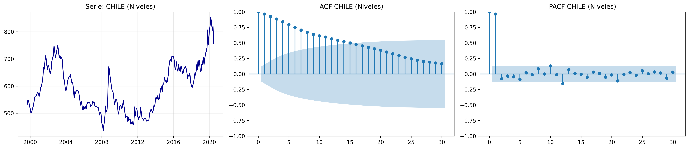
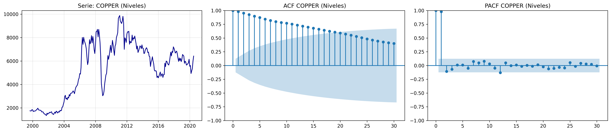
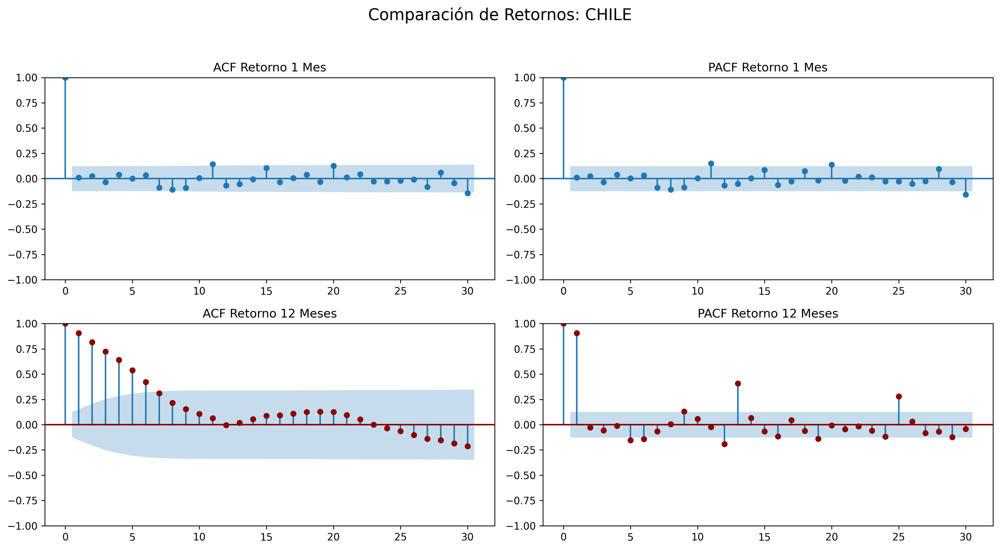
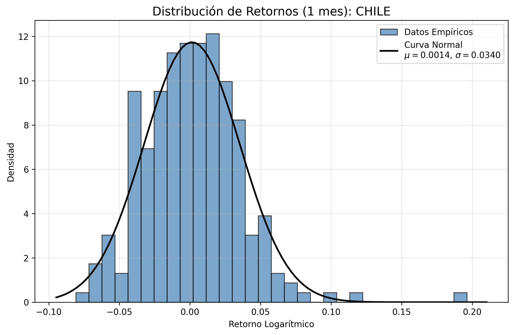
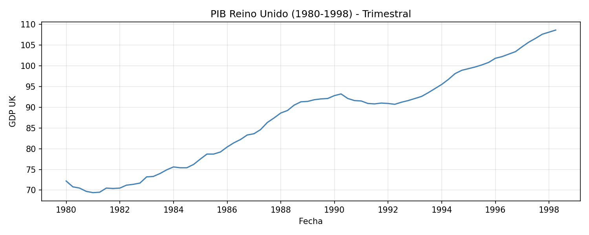
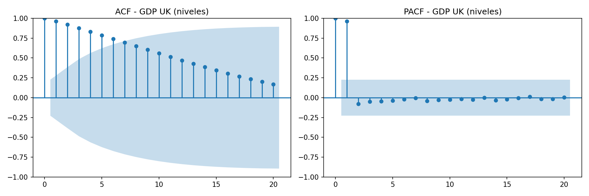
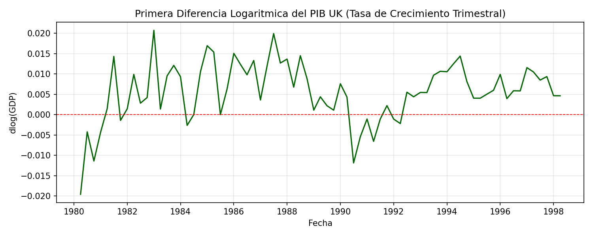
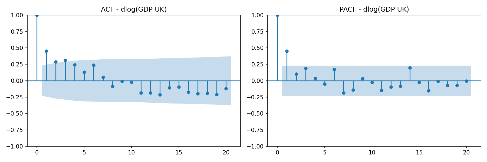
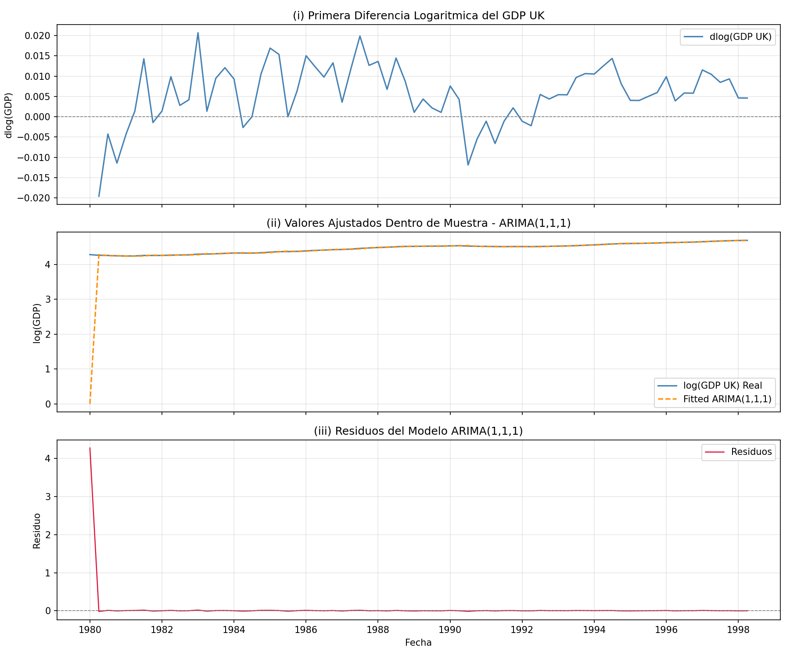

# Informe Análisis Predictivo Financiero

**Autores:** Osvaldo Ceballos · Yerko Fuentes · Paloma San Martín

---

## Pregunta 1 — Regresiones Espurias en Procesos AR(1)

**1.** En esta pregunta se usa Python como base. Los procesos se crean aleatoriamente, por lo que en teoría la relación entre X e Y es nula (k = 0). Sin embargo, al incorporar el componente autoregresivo (b = 0.5), los parámetros se ven modificados: los residuos del modelo OLS se alteran porque se subestima la varianza y se sobreestima el estadístico t. Considerando significancia al 90% de confianza:

- Significancia con errores usuales (OLS): **20.0%**
- Significancia con errores HAC: **0.0%**

**2.** Al cambiar el parámetro b a un valor entre 0.95 y 0.99 (se seleccionó b = 0.98), el pasado hipotético pesa más dentro del presente y futuro, por lo que el porcentaje de rechazo de la hipótesis nula aumenta ostensiblemente, subestimando aún más la varianza e inflando los estadísticos t. Si bien la corrección HAC reduce la significancia, no elimina el problema:

- Significancia OLS (b = 0.98): **70.0%**
- Significancia HAC (b = 0.98): **50.0%**

**3.** Al llevar b = 1, no se puede iniciar con esperanza condicional 1/(1−b), por lo que ahora se evalúa al 5%. Además, el estadístico t no tiende a una distribución normal sino que diverge, lo que hace que k tienda a 1. El porcentaje de rechazo es alto a pesar de que los datos fueron generados aleatoriamente:

- Significancia OLS (b = 1, α = 0.05): **80.0%**
- Significancia HAC (b = 1, α = 0.05): **70.0%**

**4.** En teoría, si X e Y son independientes entre sí, k debería ser 0. Sin embargo, esto no considera las relaciones espurias que emergen en series de tiempo con autocorrelación.

**5.** Por definición el nivel de rechazo debería ser el 10%. Sin embargo, el proceso AR(1) es una serie de tiempo simulada donde la autocorrelación viola el supuesto de independencia, por lo que la proporción de rechazo resulta más alta de lo esperado.

**6.** Aunque la teoría indica que dos variables completamente independientes no deberían presentar significancia entre sí, en los procesos AR(1) esto no se cumple, dando lugar a la **regresión espuria**. Es por eso que es imprescindible analizar las variables no solo desde las métricas estadísticas, sino también desde una mirada crítica sobre la relación conceptual entre ellas, para evitar este tipo de errores en casos reales.

---

## Pregunta 2 — Commodities y Tipos de Cambio

### a) Correlogramas en Niveles y Logaritmos

No hay grandes cambios entre los correlogramas en niveles y en logaritmos, dado que la transformación logarítmica no altera el orden de integración de la serie: todas presentan raíz unitaria.

**Figura 1 — CHILE: Serie en niveles y correlogramas ACF/PACF**

**Figura 2 — COPPER: Serie en niveles y correlogramas ACF/PACF**

---

### b) Estacionariedad en Primera Diferencia

Las series se vuelven estacionarias al tomar la primera diferencia logarítmica. Aplicando el test ADF sobre los datos desde septiembre de 1999, todos los p-valores se vuelven muy cercanos a cero, rechazando la hipótesis nula de raíz unitaria.

Además, el análisis debe realizarse en primera diferencia: trabajar en niveles llevaría al problema de la regresión espuria descrito en la Pregunta 1.

---

### c) Retornos a 1 Mes vs. 12 Meses

Existen diferencias importantes en los correlogramas según el horizonte de retorno:

- **Retorno a 1 mes:** baja persistencia. Los tipos de cambio y commodities no son predecibles sobre su pasado inmediato.
- **Retorno a 12 meses:** fuerte persistencia con respecto al pasado. Sin embargo, surge el problema de superposición de datos (*overlapping*): para calcular el mes 12 se usan datos de los 11 meses anteriores, generando una correlación artificial similar a la discutida en la Pregunta 1.

**Figura 3 — CHILE: Comparación de retornos a 1 mes y 12 meses (ACF/PACF)**

---

### d) Distribución de los Retornos y Normalidad

Los retornos no son consistentes con el supuesto de normalidad. Esto se debe a dos fenómenos: la distribución es muy pronunciada en el centro (leptocurtosis) y las colas son muy pesadas, lo que indica la presencia de eventos extremos que alejan los datos de la curva normal teórica.

**Figura 4 — CHILE: Distribución de retornos logarítmicos a 1 mes vs. curva Normal**

---

### e) Regresión AR(1) Aumentada con Tipo de Cambio

Resultados del modelo AR(1) + tipo de cambio (rezago 1):

- **i.** La componente autoregresiva del commodity (ρ) no es estadísticamente significativa en ningún caso.
- **ii.** El tipo de cambio (β): para el Cobre y el LMEX el parámetro no resulta significativo. En el Aluminio sí resulta significativo, tanto para el Peso Chileno como para el Dólar Australiano.
- **iii.** El aumento en R² representa cuánto explica marginalmente el tipo de cambio dentro del AR(1). Sube para el Cobre, LMEX y Aluminio.

**Tabla 1 — Regresión AR(1) aumentada con tipo de cambio (rezago 1)**

| Commodity | Tipo de Cambio | P-val ρ (AR1) | P-val β (TC) | R² Base | R² Aumentado | Aumento R² |
|-----------|---------------|:-------------:|:------------:|:-------:|:------------:|:----------:|
| COPPER    | CHILE         | 0.1106        | 0.1962       | 0.0269  | 0.0335       | 0.0066     |
| COPPER    | AUSTRALIA     | 0.1195        | 0.2938       | 0.0269  | 0.0313       | 0.0044     |
| ALUMINUM  | CHILE         | 0.6750        | 0.0136       | 0.0011  | 0.0256       | 0.0245     |
| ALUMINUM  | AUSTRALIA     | 0.3686        | 0.0061       | 0.0011  | 0.0313       | 0.0302     |
| LMEX      | CHILE         | 0.2641        | 0.1157       | 0.0214  | 0.0312       | 0.0098     |
| LMEX      | AUSTRALIA     | 0.3715        | 0.1300       | 0.0214  | 0.0305       | 0.0091     |

---

### f) Robustez con Errores HAC

Para el Cobre y el LMEX se mantiene la no significancia estadística. Para el Aluminio, los tipos de cambio sí predicen los retornos incluso aplicando la corrección HAC (Newey-West). Las conclusiones de la sección anterior se mantienen.

**Tabla 2 — Regresión AR(1) aumentada con errores HAC**

| Commodity | Tipo de Cambio | P-val ρ (HAC) | P-val β (HAC) |
|-----------|---------------|:-------------:|:-------------:|
| COPPER    | CHILE         | 0.2910        | 0.2545        |
| COPPER    | AUSTRALIA     | 0.3180        | 0.3674        |
| ALUMINUM  | CHILE         | 0.8231        | 0.0028        |
| ALUMINUM  | AUSTRALIA     | 0.6067        | 0.0057        |
| LMEX      | CHILE         | 0.5030        | 0.1514        |
| LMEX      | AUSTRALIA     | 0.5900        | 0.1897        |

---

### g) Test de Hipótesis Conjunta (β₁ = β₂ = 0)

La hipótesis nula se rechaza en los 3 activos:

- **Cobre:** p-valor del Test F = 0.0137 → se rechaza H₀.
- **LMEX:** p-valor del Test F = 0.0256 → se rechaza H₀.
- **Aluminio:** p-valor del Test F = 0.0072 → se rechaza H₀.

Esto indica que la relación entre la moneda y los precios de los metales presenta rezagos complejos que van más allá de t−1 en horizonte mensual. El Peso Chileno sería predictor de la rentabilidad de los metales bajo estas condiciones.

**Tabla 3 — Test de hipótesis conjunta sobre rezagos del tipo de cambio**

| Commodity | P-val β₁ | P-val β₂ | Estadístico F | P-val Test F |
|-----------|:--------:|:--------:|:-------------:|:------------:|
| COPPER    | 0.1328   | 0.0086   | 4.3673        | 0.0137       |
| ALUMINUM  | 0.0092   | 0.0578   | 5.0310        | 0.0072       |
| LMEX      | 0.0734   | 0.0285   | 3.7195        | 0.0256       |

---

### h) Suma de Rezagos como Variable Única

Al sumar ambos rezagos (β₁ + β₂) el parámetro se vuelve altamente significativo: la agregación actúa como un suavizado del ruido blanco. El R² baja marginalmente respecto al modelo con dos rezagos separados (menos de 0.0016 en todos los casos), validando el método ya que no se pierde validez predictiva.

**Tabla 4 — Modelo con suma de rezagos del tipo de cambio**

| Commodity | Tipo de Cambio | P-val β (Suma) | R² Modelo Suma | Caída de R² vs (g) |
|-----------|---------------|:--------------:|:--------------:|:------------------:|
| COPPER    | CHILE         | 0.0042         | 0.0591         | 0.001513           |
| COPPER    | AUSTRALIA     | 0.0927         | 0.0381         | —                  |
| ALUMINUM  | CHILE         | 0.0021         | 0.0392         | 0.00151            |
| ALUMINUM  | AUSTRALIA     | 0.0078         | 0.0296         | —                  |
| LMEX      | CHILE         | 0.0067         | 0.0503         | 0.000017           |
| LMEX      | AUSTRALIA     | 0.0781         | 0.0338         | —                  |

---

### i) Predicción Fuera de Muestra — Ventana 50/50

El modelo puede estar sobreajustado, capturando ruido en lugar de explicar el fenómeno económico. Además, las series de commodities son sensibles a cambios externos (crisis, eventos geopolíticos), lo que altera los parámetros en el tiempo y descarta el supuesto de relación constante entre variables. Por último, la estimación dentro de muestra usa implícitamente información futura (e.g., usa datos de 2010 para observar 2005), lo que no es evidencia real de predictibilidad.

Al comparar los errores cuadráticos medios en un esquema 50/50 entrenamiento-predicción, los modelos más simples tienden a ser mejores. No existen diferencias significativas entre modelos, lo que sostiene que el modelo complejo captura información irrelevante.

**Tabla 5 — Predicción fuera de muestra, ventana 50% / 50%**

| Commodity | TC        | MSE AR(1) | MSE PH    | MSE Hist  | MSE Zero  | R² OOS (%) | P-val DM |
|-----------|-----------|----------:|----------:|----------:|----------:|:----------:|:--------:|
| COPPER    | CHILE     | 0.004173  | 0.004272  | 0.003747  | 0.003636  | −2.375     | 0.5618   |
| COPPER    | AUSTRALIA | 0.004173  | 0.004203  | 0.003747  | 0.003636  | −0.736     | 0.6615   |
| ALUMINUM  | CHILE     | 0.003151  | 0.003133  | 0.002962  | 0.002934  |  0.555     | 0.8697   |
| ALUMINUM  | AUSTRALIA | 0.003151  | 0.003098  | 0.002962  | 0.002934  |  1.676     | 0.5377   |
| LMEX      | CHILE     | 0.003063  | 0.003147  | 0.002817  | 0.002751  | −2.751     | 0.4544   |
| LMEX      | AUSTRALIA | 0.003063  | 0.003096  | 0.002817  | 0.002751  | −1.094     | 0.5412   |

---

### j) Cambios al Variar la Proporción Train-Test a 30/70

Sí existen cambios significativos al pasar de 50/50 a 30/70:

- En el Aluminio con Dólar Australiano, el modelo Pincheira-Hardy pasaba de R² OOS positivo a negativo.
- El Peso Chileno prediciendo el Aluminio se mantuvo positivo, pero el test Diebold-Mariano arroja un p-valor alto: no es estadísticamente significativo.
- Los modelos simples conservan mejor capacidad predictiva incluso con el cambio de proporción.
- La capacidad predictiva de los modelos complejos es sostenidamente inferior cuando la proporción de entrenamiento es menor al 50%.

**Tabla 6 — Predicción fuera de muestra, ventana 30% / 70%**

| Commodity | TC        | MSE AR(1) | MSE PH    | MSE Hist  | MSE Zero  | R² OOS (%) | P-val DM |
|-----------|-----------|----------:|----------:|----------:|----------:|:----------:|:--------:|
| COPPER    | CHILE     | 0.00638   | 0.00643   | 0.00644   | 0.00634   | −0.770     | 0.8160   |
| COPPER    | AUSTRALIA | 0.00638   | 0.00665   | 0.00644   | 0.00634   | −4.174     | 0.2197   |
| ALUMINUM  | CHILE     | 0.00376   | 0.00369   | 0.00369   | 0.00365   |  1.667     | 0.6406   |
| ALUMINUM  | AUSTRALIA | 0.00376   | 0.00386   | 0.00369   | 0.00365   | −2.681     | 0.5233   |
| LMEX      | CHILE     | 0.00427   | 0.00429   | 0.00428   | 0.00422   | −0.448     | 0.8939   |
| LMEX      | AUSTRALIA | 0.00427   | 0.00443   | 0.00428   | 0.00422   | −3.747     | 0.2861   |

---

### k) Precisión Direccional (MDA)

Con la configuración 50/50, ningún modelo logra vencer a lanzar una moneda. El modelo Pincheira-Hardy presenta un MDA entre 40% y 46%, sin superar la elección aleatoria de dirección. El promedio histórico supera el 50% por menos de un punto porcentual en Cobre y LMEX. Aplicando el test binomial, el MDA queda en 51.6%, lo que no es suficiente para afirmar que alguno de los modelos predice de forma útil la dirección del retorno mensual.

**Tabla 7 — Evaluación de precisión direccional (MDA)**

| Commodity | TC        | MDA AR1 (%) | P-val AR1 | MDA PH (%) | P-val PH | MDA Hist (%) | P-val Hist |
|-----------|-----------|:-----------:|:---------:|:----------:|:--------:|:------------:|:----------:|
| COPPER    | CHILE     | 41.94       | 0.9706    | 45.97      | 0.8384   | 50.81        | 0.4642     |
| COPPER    | AUSTRALIA | 41.94       | 0.9706    | 41.94      | 0.9706   | 50.81        | 0.4642     |
| ALUMINUM  | CHILE     | 40.32       | 0.9878    | 45.16      | 0.8785   | 44.35        | 0.9111     |
| ALUMINUM  | AUSTRALIA | 40.32       | 0.9878    | 51.61      | 0.3939   | 44.35        | 0.9111     |
| LMEX      | CHILE     | 42.74       | 0.9562    | 45.97      | 0.8384   | 51.61        | 0.3939     |
| LMEX      | AUSTRALIA | 42.74       | 0.9562    | 41.94      | 0.9706   | 51.61        | 0.3939     |

---

### l) Rentabilidad con Estrategia Anatolyev-Gerko y Test PHB

Ninguno de los modelos logra generar rentabilidad positiva. Con la estrategia de Anatolyev y Gerko usando pronósticos del AR(1), las rentabilidades son negativas en todos los casos. El modelo Pincheira-Hardy logra un retorno positivo en Cobre y pierde menos en LMEX y Aluminio, pero al aplicar el test de significancia propuesto por los mismos autores, el p-valor es de 0.42, lo que no es estadísticamente relevante.

**Tabla 8 — Evaluación de rentabilidad (estrategia AG & test PHB)**

| Commodity | TC        | Ret. Med. AR1 (%) | P-val AR1 | Ret. Med. PH (%) | P-val PH | Ret. Med. Hist (%) | P-val Hist |
|-----------|-----------|:-----------------:|:---------:|:----------------:|:--------:|:-----------------:|:-----------:|
| COPPER    | CHILE     | −0.518            | 0.8935    |  0.073           | 0.4281   | −0.153            | 0.6339      |
| COPPER    | AUSTRALIA | −0.518            | 0.8935    | −0.421           | 0.8184   | −0.153            | 0.6339      |
| ALUMINUM  | CHILE     | −1.308            | 0.9989    | −0.192           | 0.7091   | −0.609            | 0.9120      |
| ALUMINUM  | AUSTRALIA | −1.308            | 0.9989    | −0.195           | 0.6421   | −0.609            | 0.9120      |
| LMEX      | CHILE     | −0.240            | 0.7398    | −0.079           | 0.5844   | −0.184            | 0.6701      |
| LMEX      | AUSTRALIA | −0.240            | 0.7398    | −0.615           | 0.9860   | −0.184            | 0.6701      |

---

## Pregunta 3 — Metodología Box-Jenkins (GDP UK)

Se utiliza el archivo `GDP UK.xlsx` que contiene observaciones trimestrales del producto interno bruto del Reino Unido para el período 1980–1998 (74 observaciones).

---

### a) Análisis Preliminar de Estacionariedad

Se grafica la serie de GDP UK y se construyen los gráficos de autocorrelación (ACF) y autocorrelación parcial (PACF). La serie no es estacionaria y se comporta como una serie de raíz unitaria (Random Walk): la PACF cae abruptamente a cero en el lag 1 y la ACF decae lentamente de forma lineal, ambos patrones consistentes con una serie no estacionaria de raíz unitaria.

**Figura 5 — PIB Reino Unido: serie trimestral 1980–1998**

**Figura 6 — GDP UK: ACF y PACF en niveles**

---

### b) Análisis en Primeras Diferencias Logarítmicas

La serie dlog(GDP) fluctúa alrededor de una media constante positiva. La ACF cae rápida y abruptamente hacia cero desde el lag 1, patrón consistente con un proceso estacionario (posiblemente ruido blanco o ARMA de bajo orden). La primera diferencia logarítmica elimina la tendencia y la serie resulta estacionaria, lo que sugiere que la serie en niveles es integrada de orden 1: **I(1)**.

**Figura 7 — Primera diferencia logarítmica del GDP UK (tasa de crecimiento trimestral)**

**Figura 8 — dlog(GDP UK): ACF y PACF**

---

### c) Orden de Integración y Selección de Modelos ARIMA

Para formalizar el análisis se aplica el **test ADF (Augmented Dickey-Fuller)** sobre la serie en niveles y en primera diferencia logarítmica.

**Tabla 9 — Resultados del test ADF para determinar el orden de integración**

| | log(GDP UK) — Niveles | dlog(GDP UK) — 1ª Diferencia |
|---|:---:|:---:|
| Estadístico ADF | −1.2371 | −3.8676 |
| P-valor | 0.6574 | **0.0023** |
| Lags utilizados | 3 | 2 |
| Valor crítico 1% | −3.5274 | −3.5274 |
| Valor crítico 5% | −2.9038 | −2.9038 |
| Valor crítico 10% | −2.5893 | −2.5893 |
| Conclusión | No estacionaria | **Estacionaria** |

**Conclusión:** log(GDP UK) no es estacionario en niveles; dlog(GDP UK) sí lo es. La serie es integrada de orden 1: **I(1)**. Se modela con d = 1 en el ARIMA(p, 1, q).

#### Especificaciones candidatas ARIMA(p, 1, q)

La ACF de dlog(GDP) muestra autocorrelación significativa en lag 1 y/o 2, mientras que la PACF muestra un corte abrupto tras el lag 1 o 2. Esto sugiere que componentes AR y MA de bajo orden son razonables, manteniendo parsimonia en los parámetros.

| Modelo | Justificación |
|--------|--------------|
| **ARIMA(1,1,0)** | PACF con pico en lag 1 → componente AR(1) domina. Equivalente a AR(1) sobre la primera diferencia. |
| **ARIMA(0,1,1)** | ACF con pico en lag 1 y caída brusca → componente MA(1). Equivalente al modelo IMA(1,1). |
| **ARIMA(1,1,1)** | Combina AR(1) y MA(1) para mayor flexibilidad. Captura patrones mixtos en la autocorrelación. |
| **ARIMA(2,1,0)** | AR(2) sobre la primera diferencia, si la PACF muestra autocorrelación significativa hasta el lag 2. |

---

### d) Estimación de Modelos ARIMA y Selección

Se estiman las cuatro especificaciones candidatas. El criterio de selección principal es el AIC, complementado con BIC, Durbin-Watson y el test de Ljung-Box sobre los residuos.

**Tabla 10 — Comparación de modelos ARIMA candidatos**

| Modelo | AIC | BIC | Log-Lik | DW | LB p-val (lag 10) |
|--------|----:|----:|--------:|:--:|:-----------------:|
| **ARIMA(1,1,1)** | **−527.491** | −520.619 | 266.745 | 1.0093 | 1.0000 |
| ARIMA(2,1,0) | −523.900 | −517.028 | 264.950 | 1.0094 | 1.0000 |
| ARIMA(1,1,0) | −522.667 | −518.086 | 263.333 | 1.0094 | 1.0000 |
| ARIMA(0,1,1) | −504.409 | −499.828 | 254.205 | 1.0093 | 1.0000 |

**Mejor modelo por AIC: ARIMA(1,1,1)**

**Figura 9 — ARIMA(1,1,1): primera diferencia, valores ajustados y residuos**

#### Por qué el R² no es apropiado para seleccionar modelos ARIMA

1. El R² aumenta mecánicamente al agregar parámetros, favoreciendo el sobreajuste.
2. No penaliza la complejidad del modelo (a diferencia de AIC/BIC).
3. En modelos con diferenciación (d > 0), el R² compara con una media trivial de la serie diferenciada, no con la serie original, lo que puede ser engañoso.
4. Los criterios AIC y BIC penalizan la log-verosimilitud por el número de parámetros (BIC penaliza más fuertemente).

#### Comportamiento esperado de los residuos

- Distribución aproximadamente normal con media cero.
- Sin autocorrelación significativa (ruido blanco) → test Ljung-Box no debe rechazar H₀.
- Varianza constante (homocedasticidad).
- DW cercano a 2. En los modelos estimados, el estadístico DW es prácticamente idéntico en todos los casos (~1.009), lo que sugiere autocorrelación residual positiva moderada que no es captada completamente por ninguna de las cuatro especificaciones.

---

### e) Problemas de la Estimación Dentro de Muestra para el Pronóstico 2022–2030

El análisis predictivo de series de tiempo tiene un problema importante cuando solo se evalúa dentro de la muestra de estimación: los modelos tienden a ajustarse muy bien a los datos históricos, pero fallan al predecir fuera de ese rango. Esto se agrava cuando existe una brecha temporal grande entre la muestra de estimación y el horizonte de pronóstico, ya que cambios estructurales relevantes quedan fuera del modelo y la incertidumbre crece con el tiempo. Por eso, según lo indicado en las referencias del enunciado coinciden en que la única forma de saber si un modelo realmente predice bien es evaluarlo con datos que no vio durante la estimación.

Para esto, West (2006) sentó las bases  del análisis fuera de muestra, distinguiendo distintos esquemas de ventana y mostrando cómo hacer inferencia sobre qué modelo predice mejor. Por su parte, Pincheira & Hardy (2019, 2021) tratan de solucionar el problema proponiendo el R²_OOS para medir qué tan bien le va al modelo versus benchmarks simples como la caminata aleatoria, advirtiendo además que un modelo estadísticamente significativo no necesariamente genera valor económico real. Para evaluar esa dimensión práctica, desarrollan el test PHB, que mide si las estrategias basadas en pronósticos efectivamente generan rentabilidades positivas, corrigiendo por autocorrelación con estimadores HAC.

Para un pronóstico robusto del GDP UK hasta 2030 sería necesario: actualizar la muestra de estimación con datos post-1998, comparar el modelo ARIMA contra *benchmarks* simples mediante un esquema OOS recursivo o *rolling*, calcular el R²\_OOS para evaluar si el modelo agrega valor predictivo real, y reportar intervalos de predicción que incorporen la incertidumbre tanto del pronóstico como de los parámetros.
